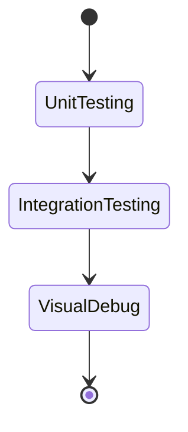

#  Test Plan - Procedural Map Generation

> *Version: 1.0.0*
> *Last Updated: June 30, 2025*
> *Status: Draft*

## 📋 Table of Contents

1. [Purpose and Objectives](#1-purpose-and-objectives)
2. [Scope](#2-scope)
3. [Testing Strategy](#3-testing-strategy)
4. [Resources](#4-resources)
5. [Test Environment](#5-test-environment)
6. [Acceptance Criteria](#6-acceptance-criteria)
7. [Test Deliverables](#7-test-deliverables)
8. [Risks and Contingencies](#8-risks-and-contingencies)
9. [Timeline](#9-timeline)
10. [Reporting](#10-reporting)

---

## 1. Purpose and Objectives

### 1.1 Overview

This document defines the test strategy and quality expectations for the **Procedural Map Generation** module of the **RoleWorld Engine**, focusing on the correctness, stability, and integration of noise, falloff, and biome logic.

### 1.2 Key Objectives

| Objective        | Description                                             | Priority |
| ---------------- | ------------------------------------------------------- | -------- |
| Noise Validity   | Generated values must be deterministic and normalized   | High     |
| Falloff Quality  | Maps should visually match expected radial decay        | High     |
| Biome Accuracy   | Correct mapping of noise values to terrain types        | High     |
| Generation Speed | Map generation must remain responsive (<1s for 128x128) | Medium   |

---

## 2. Scope

### 2.1 Features to be Tested

#### Core Procedural Systems

* [x] `PerlinNoise` float generation with smooth gradients
* [x] `FalloffMap` generation
* [x] Combination: `FinalMap = Noise * Falloff`
* [x] `MapGenerator.Generate(...)` data consistency
* [x] Biome classification based on height thresholds

### 2.2 Features Not in Scope

* ❌ UI rendering
* ❌ Saving/Loading system
* ❌ In-game simulation logic
* ❌ Event or faction systems

---

## 3. Testing Strategy

### 3.1 Test Types Matrix

| Test Type       | Focus                           | Tools                   | Priority |
| --------------- | ------------------------------- | ----------------------- | -------- |
| **Unit**        | Perlin math, fade, dot product  | xUnit, FluentAssertions | High     |
| **Integration** | `MapGenerator` output structure | xUnit + Mock Falloff    | High     |
| **Visual**      | Manual preview of map images    | Console / Debug Image   | Medium   |
| **Performance** | Gen time & memory for 128x128+  | Stopwatch / Profiler    | Medium   |

### 3.2 Testing Workflow

---

### 4.2 Stack & Tools

| Category     | Tools                           |
| ------------ | ------------------------------- |
| Development  | Rider 2025.1, .NET 8, C#        |
| Testing      | xUnit    |
| Debug / Logs | Console |

---

### 5 Dependencies

* None (no UI, no database)
* Headless environment (console-based only)

---

## 6. Acceptance Criteria

### 6.1 Core Tests

| Component        | Criteria                                                   |
| ---------------- | ---------------------------------------------------------- |
| `PerlinNoise`    | Normalized in \[0,1], deterministic per input              |
| `FalloffMap`     | Central values > edge values, symmetrical decay            |
| `MapData`        | HeightMap and BiomeMap initialized, dimensions match input |
| `GetTerrainType` | Correct biome mapped per noise threshold                   |
| Visual Debug     | Map shows smooth transitions, clear biome zones (manua     |
